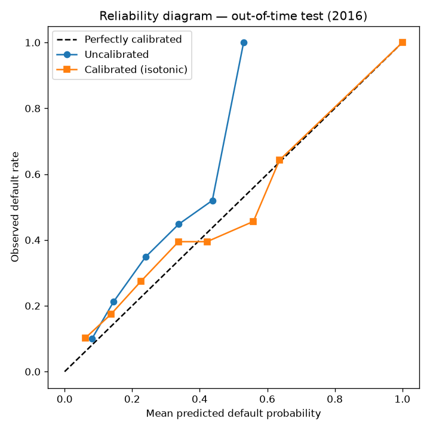

# Explainable Credit Risk & Portfolio Analytics Platform


A probability-of-default (PD) credit risk model built with methodology that
mirrors real-world credit risk practice: out-of-time validation, probability
calibration, SHAP-based explanations grounded in natural language, fairness
auditing, portfolio-level risk aggregation, drift monitoring, and a FastAPI
serving layer.

> 📄 **For the full end-to-end write-up** — data sourcing, methodology, all
> results, the four key findings, and conclusions — see **[REPORT.md](REPORT.md)**.
> This README is the quick tour.

## Results (out-of-time test, 2016 vintage)

| Metric | Train | Validation (2015) | Test (2016, OOT) |
|---|---|---|---|
| AUC | 0.79 | 0.72 | 0.68 |
| KS | 0.44 | 0.32 | 0.28 |

Isotonic calibration reduces the Brier score on the held-out test vintage and
brings predicted probabilities in line with observed default rates:



The train-to-test gap is visible and *measured* rather than hidden — a
consequence of using an out-of-time split instead of a random one. See the
"Key finding" below.

Calibration also tightens the Brier score on the test vintage (≈0.173 → 0.170),
and the portfolio layer aggregates the calibrated PDs into an expected loss of
~10% of exposure and a Basel IRB-style capital estimate of ~18% of exposure.

### Ablation: leakage check and baselines

Because `int_rate`, `grade`, and `sub_grade` are assigned by Lending Club's own
risk process, [`experiments/ablation.py`](experiments/ablation.py) checks how
much they inflate the result, and whether the gradient boosting is justified:

| Model | AUC | KS |
|---|---|---|
| FULL — XGBoost, all features | 0.687 | 0.286 |
| NO_PRICING — without int_rate/grade/sub_grade | 0.649 | 0.227 |
| BASELINE — logistic regression | 0.676 | 0.260 |

Removing the pricing variables costs only ~0.04 AUC, so the model is not merely
echoing a pre-computed grade; and XGBoost beats a logistic baseline by only
~0.01, so the signal is largely linear. See
[`ABLATION_FINDINGS.md`](ABLATION_FINDINGS.md) for the full discussion.

## Key finding: right-censoring by vintage

Loan outcomes in the Lending Club data are **right-censored by vintage**: the
share of loans that have reached a final outcome (Fully Paid / Charged Off)
drops sharply for recent issue years — roughly 95% for 2014, but only ~40% for
2017 and ~11% for 2018, because newer loans are mostly still "Current".

Naively training or testing on those recent vintages would bias the model
toward loans that happen to resolve quickly (typically shorter-term loans). The
out-of-time split is therefore restricted to vintages with high resolution
rates (train < 2015, validation = 2015, test = 2016), and 2017–2018 loans are
excluded from modeling entirely. See [`TARGET_DEFINITION.md`](TARGET_DEFINITION.md)
for the full analysis.

## Methodology highlights

- **Out-of-time validation** (not random split) — trains on older loans and
  tests on newer ones, the way a deployed credit model actually faces the future.
- **Probability calibration** — a PD must be a real probability (used directly
  for expected-loss and capital calculations), not just a well-ranked score.
- **Grounded explanations** — SHAP identifies the drivers of each decision; an
  LLM layer translates them into natural-language adverse-action reasons, with a
  validation guard that rejects any explanation introducing factors SHAP did not
  surface. See [`src/llm_explain.py`](src/llm_explain.py).
- **Fairness audit** — disparate-impact / four-fifths-rule checks across income
  and region proxy groups.
- **Portfolio layer** — aggregates PD into expected loss (PD × LGD × EAD) and a
  Basel IRB-style capital estimate.
- **PSI monitoring** — segmented drift detection that surfaces subgroup drift an
  aggregate metric would hide. See [`PSI_FINDINGS.md`](PSI_FINDINGS.md).
- **Serving + CI** — FastAPI service ([`API.md`](API.md)), Dockerfile, and a
  GitHub Actions pipeline running the test suite on every push.

## Project structure

```
credit-risk-analytics/
├── src/                    # Core modules (imported by tests and the API)
│   ├── oot_split.py        # Target definition + out-of-time split
│   ├── features.py         # Feature engineering
│   ├── model.py            # XGBoost PD model
│   ├── metrics.py          # AUC + KS
│   ├── calibration.py      # Isotonic calibration + reliability diagram
│   ├── explain.py          # SHAP drivers per applicant
│   ├── llm_explain.py      # Grounded natural-language adverse-action reasons
│   ├── fairness.py         # Disparate-impact audit
│   ├── portfolio.py        # Expected loss + Basel capital
│   └── psi.py              # Population Stability Index monitoring
├── api.py                  # FastAPI service
├── scripts/
│   ├── make_sample.py      # Build a lightweight sample from the full dataset
│   └── train_and_save.py   # Train and persist model artifacts for serving
├── notebooks/01_eda.py     # EDA (VS Code cell format)
├── tests/                  # pytest suite (17 tests)
├── reports/                # Generated figures
├── Dockerfile
├── TARGET_DEFINITION.md    # Target logic + right-censoring analysis
├── PSI_FINDINGS.md         # Drift monitoring findings
└── API.md                  # API usage
```

## Data

Lending Club accepted-loans dataset (2007–2018), publicly available on
[Kaggle](https://www.kaggle.com/datasets/wordsforthewise/lending-club). The raw
file is not included in this repo (licensing + size). To reproduce:

1. Download `accepted_2007_to_2018Q4.csv` from Kaggle into `data/`.
2. Run `python scripts/make_sample.py` to create a lightweight working sample.

## Setup

```bash
python -m venv .venv
source .venv/bin/activate        # Windows: .venv\Scripts\Activate.ps1
pip install -r requirements.txt
```

## Reproduce the analysis

```bash
python notebooks/01_eda.py       # EDA + target definition + censoring finding
python src/oot_split.py          # Out-of-time split summary
python src/model.py              # Train model + AUC/KS
python src/calibration.py        # Calibration + reliability diagram
python src/fairness.py           # Fairness audit
python src/portfolio.py          # Portfolio expected loss + capital
python src/psi.py                # Drift monitoring
```

## Run the API

```bash
python scripts/train_and_save.py   # persist model artifacts
uvicorn api:app --reload           # docs at http://localhost:8000/docs
```

## Run the tests

```bash
pytest tests/ -v
```

## Limitations & design decisions

Deliberately scoped choices, stated plainly so the results are read in context:

- **Endogenous pricing features.** `int_rate` / `grade` / `sub_grade` are partly
  outputs of Lending Club's own underwriting. They are kept in the primary model
  but their effect is isolated in the ablation study; the NO_PRICING model is the
  more conservative estimate of borrower-intrinsic risk.
- **Class imbalance (~20% default).** Handled implicitly — tree models and the
  AUC/KS/Brier metrics used here are threshold-independent, so the raw imbalance
  is not resampled. A production scorecard would additionally tune a decision
  threshold to a business cost matrix.
- **Approval threshold in the fairness audit is illustrative** (approve the
  ~70% lowest-risk). A real deployment would set it from an expected-loss or
  acceptance-rate target, not a round number.
- **Proxy fairness groups.** The data has no direct protected attributes, so the
  audit uses income and region proxies; this screens for disparity but is not a
  compliance-grade fair-lending analysis.
- **LGD/EAD are fixed assumptions** (LGD 45%, EAD = loan amount) rather than
  modeled, so the capital figure is illustrative of the pipeline, not a
  regulatory number.
- **Sample-based metrics.** Figures come from a representative sample run; exact
  values vary slightly with the sample and random seed.

## Notes

The natural-language explanation layer calls the Anthropic API and requires
`ANTHROPIC_API_KEY` to be set. All other components run offline.
